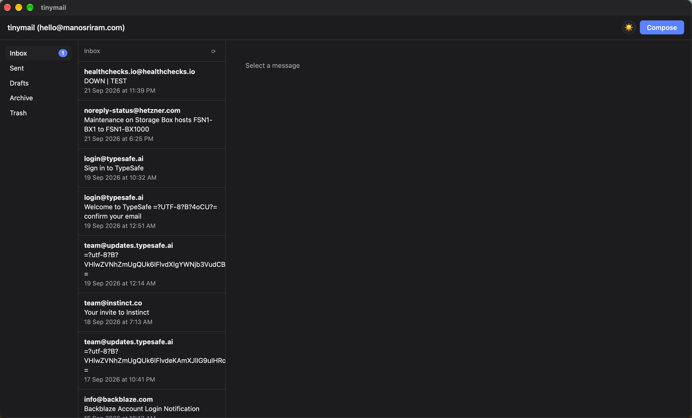
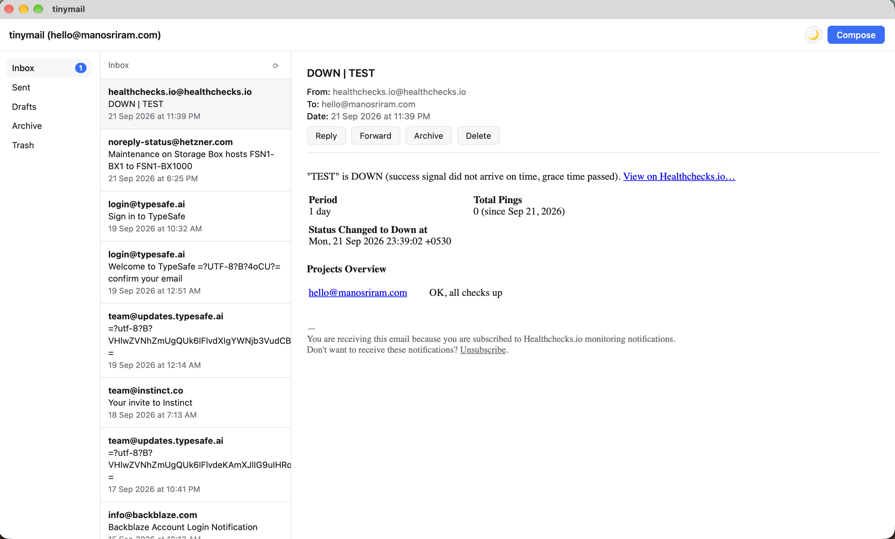
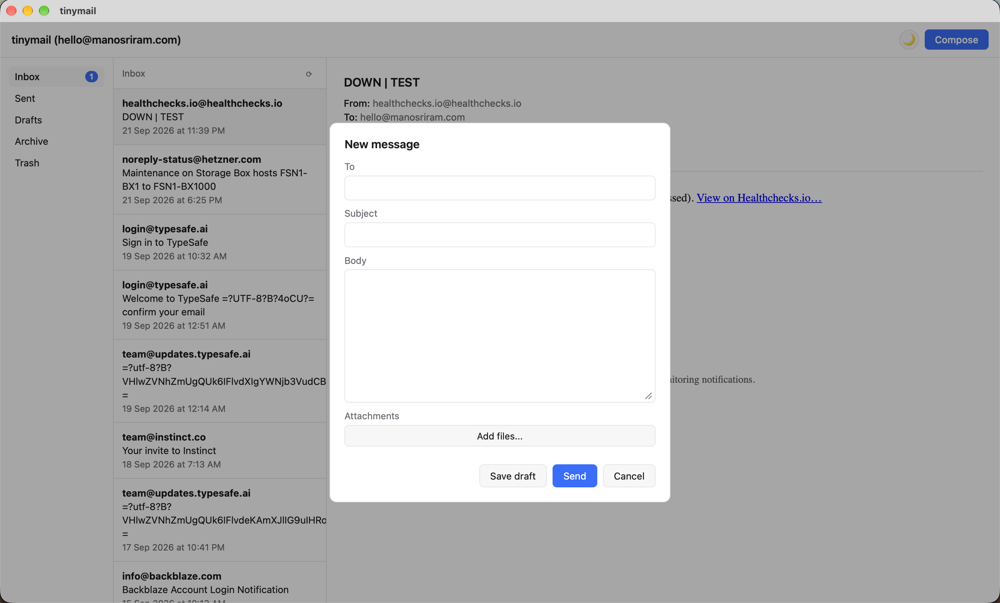

tinymail - lightweight email client

tinymail is a small native desktop client for reading and sending email over IMAP and SMTP. It shows a single inbox alongside sent, drafts, archive, and trash, supports reading, composing, replying, forwarding, and attachments, and switches between light and dark themes.

The app connects to any IMAP and SMTP account, and you can add as many accounts as you like. Switch between them from the account menu in the top-left (or with ⌘1–⌘9 / Ctrl+1–9), add or remove them under **Manage accounts**, and pick which one to send from in the compose window. New-mail notifications and unread counts cover every account. There are no accounts or servers of its own, and no data leaves the machine except to talk directly to the mail servers.

Accounts are added from the app and stored in `$HOME/tinymail.yml` (passwords encrypted with a local key in `$HOME/.tinymail.key`). You can also write the file by hand; you'll be asked for each password on first launch:
```yml
accounts:
  - imap_host: IMAP_HOST
    imap_port: 993
    smtp_host: SMTP_HOST
    smtp_port: 465
    username: email
    sent_folder: Sent
    drafts_folder: Drafts
    archive_folder: Archive
    trash_folder: Trash
```
The older single-account format (the same keys at the top level, without `accounts:`) is still read and is converted automatically when another account is added.

Keyboard shortcuts: `C` compose, `J`/`K` or arrows move through messages, `R` reply, `F` forward, `E` archive/restore, `#` trash, `⌘K` or `/` search, `⌘↵` send.






